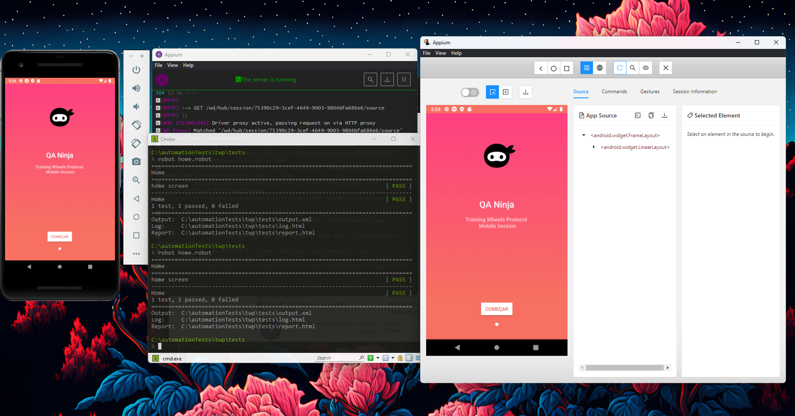

# Appium+robot_framework--Training Wheels Protocol


<h1 align="center">
  <br>
  
  <br><br>
</h1>

<p align="center">This project has an academic purpose. I adapted and structured it using my previous knowledge.</p>

<p align="center"> 
    
    
</p align="center">

## 💻 Pre-requisite
Before starting, you need to have on your computer:

### Have you installed the latest version of:
- [X] Node
- [X] Python
- [X] Robot Framework
- [X] JDK8
- [X] Cmder
- [X] Android Studio
- [X] Appium Server GUI + Appium Inspector

### Other important settings to make:
- [X] Copy the *tools folder from this file: http://dl-ssl.google.com/android/repository/sdk-tools-windows-4333796.zip
- [X] You will also need to configure the environment variables
- [X] Don't forget to configure the mandatory capability information to access the system (basic file)

<h4>To make sure that Appium is correctly installed in cmder, run the command:<h4>

```sh
appium-doctor --android
```

### install everything necessary for the project to work
```sh
pip install robotframework
```
```sh
pip install robotframework-appiumlibrary
```

### Install Vscode extensions too for better viewing

 Robocorp <br>
 Robot Framework Language Server <br>
 Thunder Client <br>
 Hyper Term Theme <br>

<!--<p align="center">
  <kbd>
    
  </kbd>
</p>-->
