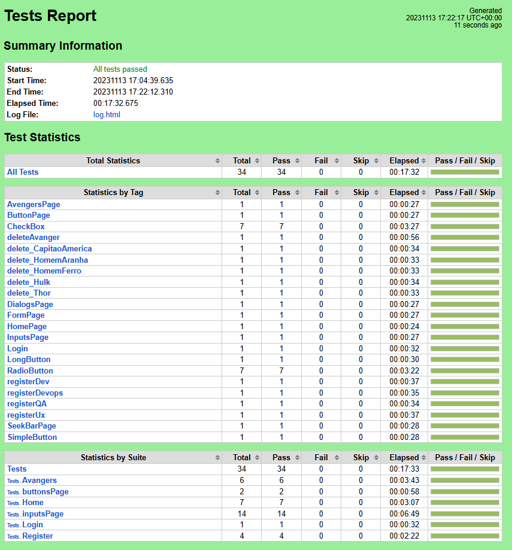

# Appium + Robot Framework — Training Wheels Protocol


This project has an academic purpose. It was adapted and structured using practical automation knowledge.


## 💡 Overview

This guide explains how to set up your environment to run Robot Framework automated tests using Appium on Android simulators. We’ll go through installing all tools, configuring environment variables, and preparing everything to run tests smoothly.

---

## 🧰 1. Pre-Requisites: Install Essential Tools

- [X] Install Node.js

Download from: https://nodejs.org/  
Install the **LTS version**.

Verify installation:
```sh
node -v
```
```sh
npm -v
```

---

- [X] Install Python

Download from: https://www.python.org/downloads/release/python-3125/

#### First screen – check:
- ☑️ Install launcher for all users (recommended)
- ☑️ Add Python to PATH
- Click **Customize installation**

#### Optional Features:
- ☑️ Documentation  
- ☑️ pip  
- ☑️ tcl/tk and IDLE  
- ☑️ Python test suite  
- ☑️ py launcher (for all users)

#### Advanced Options:
- ☑️ Install for all users  
- ☑️ Associate files with Python  
- ☑️ Add Python to environment variables  
- ☑️ (Optional) Precompile standard library  
- (Optional) Customize location: `C:\Python`

Verify installation:
```sh
python --version
```
```sh
pip --version
```

---

- [X] Install VSCode (Recommended)

Download: https://code.visualstudio.com/

Install the following extensions:

 Robocorp <br>
 Robot Framework Language Server <br>
 Thunder Client <br>
 Hyper Term Theme <br>

---

## 🔁 Clone the Project & Install Dependencies

- [X] Clone the Repository

If you don’t have Git, install it from: https://git-scm.com/downloads

Clone:
```sh
git clone https://github.com/GOEVIO/QA_Automation.git
```
Navigate to the folder:
```sh
cd QA_Automation
```

---

- [X] Install Python Dependencies

> This project already includes a `requirements.txt` file.

Install all dependencies:
```sh
pip install -r requirements.txt
```

---

- [X] Verify Robot Framework Installation
```sh
robot --version
```

---

## 🖥️ 2. Terminal Setup (Recommended: Cmder)

Download: https://cmder.app/  
Extract to: `C:\Tools\cmder`

Set the system environment PATH:
```
C:\Tools\cmder
```

Test:
```sh
git --version
```

---

## ☕ 3. Install Java JDK 8 (Required for Android)

Download from: https://www.oracle.com/java/technologies/javase/javase8-archive-downloads.html  
Install the **64-bit version (JDK 1.8.x)**

### Set JAVA_HOME:
```
C:\Program Files\Java\jdk1.8.0_202
```

Add to system `PATH`:
```
C:\Program Files\Java\jdk1.8.0_202\bin
```

Verify:
```sh
java -version
```
```sh
echo %JAVA_HOME%
```

---

## 🤖 4. Set Up Android Studio & SDK

Download: https://developer.android.com/studio  
Open **Device Manager** → Create and start a virtual device (emulator)

### Set environment variables:

ANDROID_HOME:
```
C:\Users\<YourUsername>\AppData\Local\Android\Sdk
```

ADB_PATH:
```
C:\Users\<YourUsername>\AppData\Local\Android\Sdk\platform-tools
```

Add to system `PATH`:
```
%ANDROID_HOME%\platform-tools
%ANDROID_HOME%\tools
%ANDROID_HOME%\tools\bin
%ANDROID_HOME%\tools\lib
```

> 📦 NOTE: The tools folder is deprecated in some Android Studio versions. If missing:  
Download from: http://dl-ssl.google.com/android/repository/sdk-tools-windows-4333796.zip  
Extract into the SDK directory.

Verify:
```sh
echo %ANDROID_HOME%
```
```sh
adb devices
```

---

## 🧪 5. Install Appium & Appium Doctor

Install Appium and doctor globally via npm:
```sh
npm install -g appium
```
```sh
npm install -g appium-doctor
```

Verify Appium setup:
```sh
appium-doctor --android
```

---

## 🖥️ 6. Install Appium Desktop Tools

- Appium Server GUI: https://github.com/appium/appium-desktop/releases  
- Appium Inspector: https://github.com/appium/appium-inspector/releases

---

## ⚙️ 7. Start the Environment for Testing

- [X] Start your Android Emulator
Open **Android Studio → Device Manager**  
Click ▶️ to start the virtual device

- [X] Launch Appium Server GUI
Open the app and click “Start Server”

- [X] Open Appium Inspector

- [X] Get Emulator UDID
```sh
adb devices
```

Use the UDID in your test configuration or capability files

---

## ▶️ Running Tests

Make sure you're in the root of the project:
```sh
robot tests/login_test.robot
```

---

## 🎯 Final Tips

For each test run:

- [X] Android Emulator ON  
- [X] Appium GUI Server ON  
- [X] Appium Inspector OPEN (optional)

---

## 📊 Example Test Report Output


